# 3. Introducción a las APIs REST 17m

* ¿Qué es una API REST? 5:06 
* ¿Cómo construir una petición HTTP? 5:48 
* ¿Cómo probar servicios REST? 6:18 
* Contenido adicional 2

## ¿Qué es una API REST? 5:06 

[Qué_es_una_API_REST.pdf](pdfs/Qué_es_una_API_REST.pdf)

Vídeo recomendado: [Qué es REST](https://www.youtube.com/watch?v=aoOKxUOhg18)

### REST (Representational State Transfer)

* Separación entre cliente y servidor
* Visibilidad y escalabilidad
* Independiente de la plataforma y lenguaje

Intercambio de información basado principalmente en XML y JSON

EJEMPLO XML

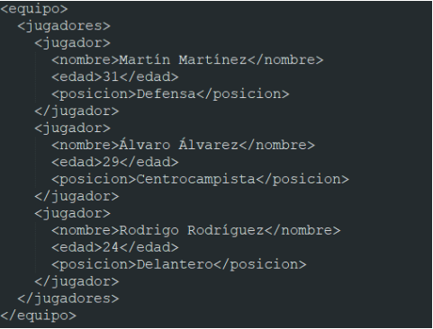

EJEMPLO JSON

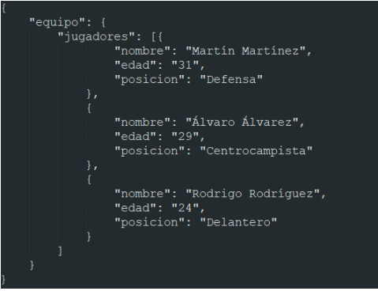

MÉTODOS HTTP

* **GET**: Acceder un recurso de un servidor, método seguro es decir no modifica el estado del recurso, se usa para **Consultar la información**.
* **POST**: Crea un nuevo recurso cada que lo invoquemos, aun enviando la misma información, por lo que es un método no seguro, se usa para **Crear nueva información**.
* **PUT**: Método no seguro por que modifica el estado del recurso, es *Idempotente* es decir que si siempre ejecutamos esa misma acción el estado no cambia, por lo que se usa para **Actualizar la información**, si la información no existe la crea y si ya existe la actualiza.
* **DELETE**: **Borra un recurso.**
* PATCH, HEAD, CONNECT, OPTIONS, TRACE

## ¿Cómo construir una petición HTTP? 5:48 

[¿Cómo construir una petición HTTP? ](pdfs/Cómo_construir_una_petición_HTTP.pdf)

### Lecturas recomendadas:

* [Métodos de petición HTTP](https://developer.mozilla.org/es/docs/Web/HTTP/Methods)
* [Códigos de estado de respuesta HTTP](https://developer.mozilla.org/es/docs/Web/HTTP/Status)

### ELEMENTOS DE UNA PETICIÓN HTTP

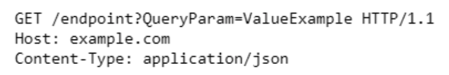

* **Method**

   Que acción realizaremos sobre un recurso.

   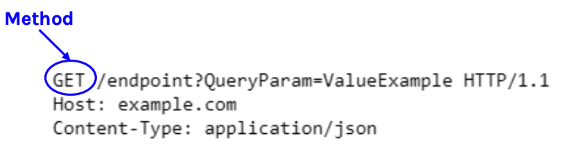

* **Path**

   Endpoint al que accedemos. Un Endpoint es un punto de entrada y salida hacia nuestra API REST, puede ser solo de entrada, solo de salida o de entrada/salida. Punto del que introducimos y/o extraemos información sobre el modelo de nuestra API.

   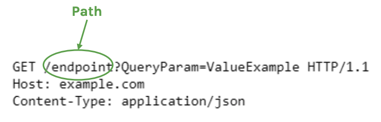

* **Query parameters**

   Parámetros de filtrado clave/valor, nos sirven para filtrar la información.

   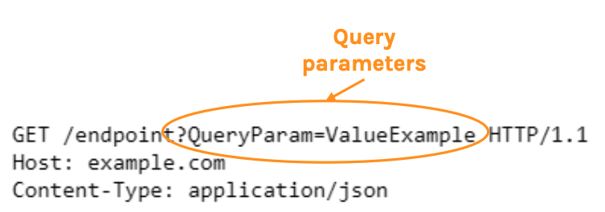

* **Protocol**

   Protocolo usado, en este caso HTTP

   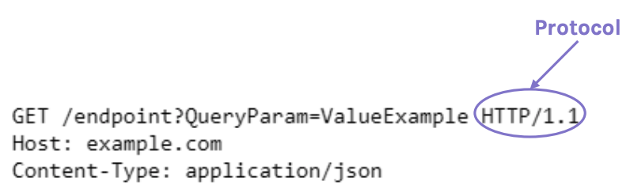

* **Host**

   Ruta básica del host para acceder al Endpoint.

   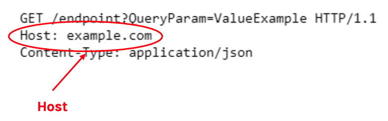

* **Headers**

   Los Headers proporcionan datos adicionales a la petición que queremos enviar. En este caso el *Content-Type* le indica que el cambio de información lo haremos con JSON.

   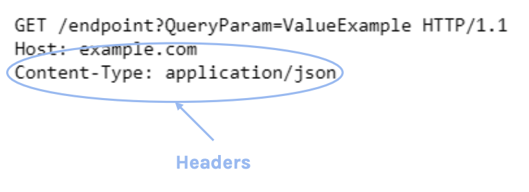

* **Body**

   En el caso de los métodos **POST** y **PUT** también debemos definir el elemento **Body**. El Body es la parte donde definimos la parte que queremos enviar, los datos que vamos a crear o a actualizar. 

   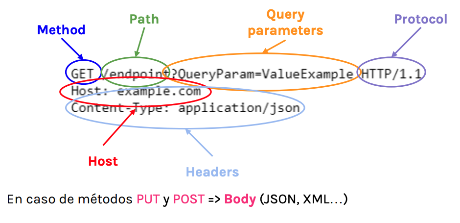   

### ELEMENTOS DE UNA RESPUESTA HTTP

* **Status code**

   El elemento principal de la respuesta es el código de estado, nos indica el resultado del estado de la operación que hemos realizado. Nos indica si la petición fue exitosa o no y si no lo ha sido por que motivo. El Status code es un número que va por series:
   
   * **1xx**: Respuestas informativas
   * **2xx**: Respuestas satisfactorias
   * **3xx**: Redirecciones
   * **4xx**: Errores de cliente, hemos definido mal algun parámetro.
   * **5xx**: Errores de servidor, errores que no dependen de nosotros, sino de la API o del servidor.
   
* **Body**
* **Headers**

## ¿Cómo probar servicios REST? 6:18 

Vamos a ver un ejemplo practico de como probar un API REST. Vamos a usar el **API de Spotyfy**. 

https://developer.spotify.com/documentation/web-api/reference/artists/get-artist/

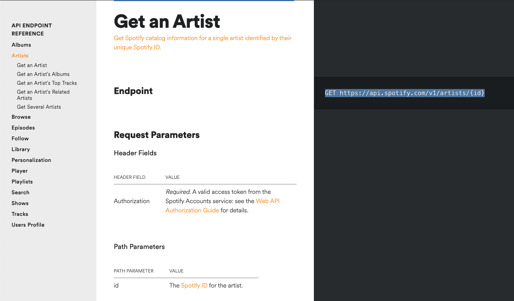

El siguiente es el Endpoit de obtener un artista:

`GET https://api.spotify.com/v1/artists/{id}`

* Lo principal es identificar el método que ocupa (`GET`), el host (`https://api.spotify.com`), el Endpoint (`/v1/artists/`) y los parámetros que se pasan (`{id}`) o headers incluso un body.

* Lo siguiente es identificar los parámetros que no son fijos o variables dentro del **Path Parameters**, en este caso `{id}`, es importante por que en función de lo que se mande se obtendra un resultado u otro. 

   Ademas de esto según la documentación de la API es necesario enviar el parámetro **Authorization** dentro de los **HEADER FIELD**.  
   
   Dependiendo de los **Path Parameters** y los **HEADER FIELD** podremos generar diferentes casos de prueba. Un posible caso de prueba es cuando no ponemos ningún identificador, en este caso según la documetación nos debería de dar un error. Otro caso de prueba es poniendo un identificador. 

## Contenido adicional 2

[Qué_es_una_API_REST.pdf](pdfs/Qué_es_una_API_REST.pdf)

[¿Cómo construir una petición HTTP? ](pdfs/Cómo_construir_una_petición_HTTP.pdf)
