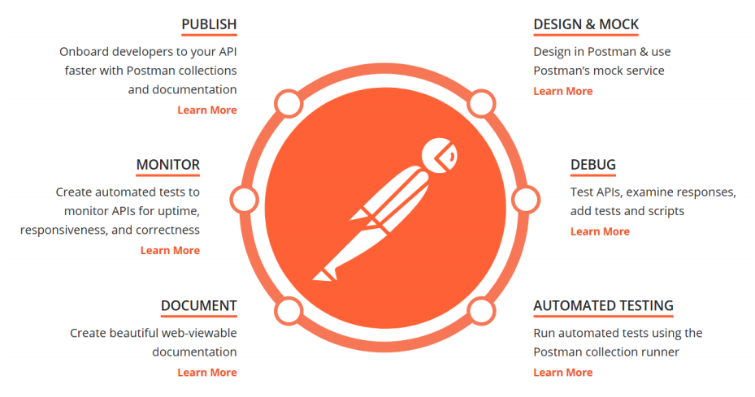
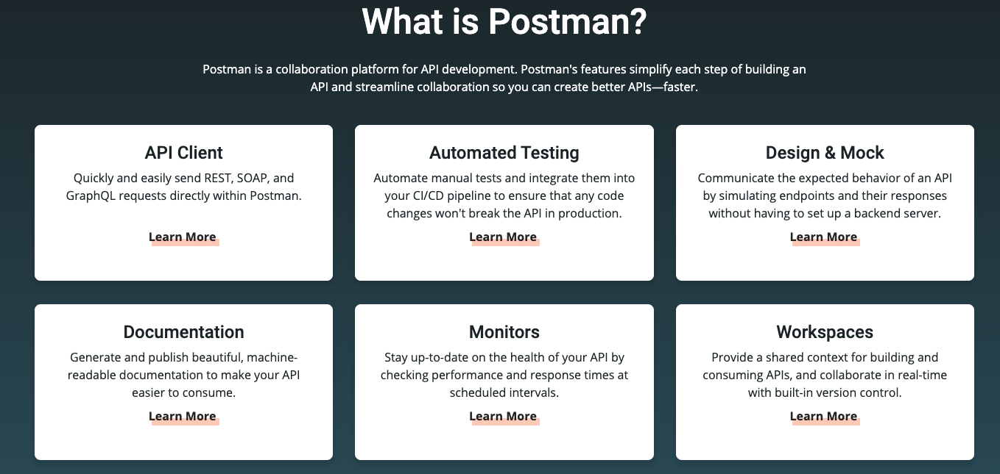
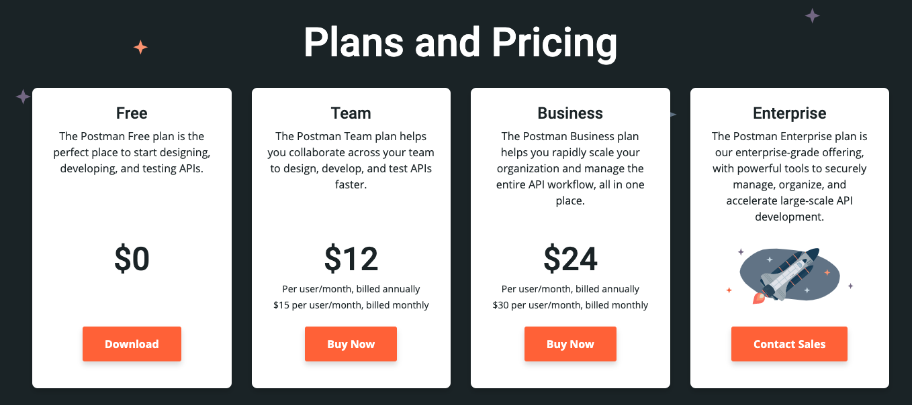
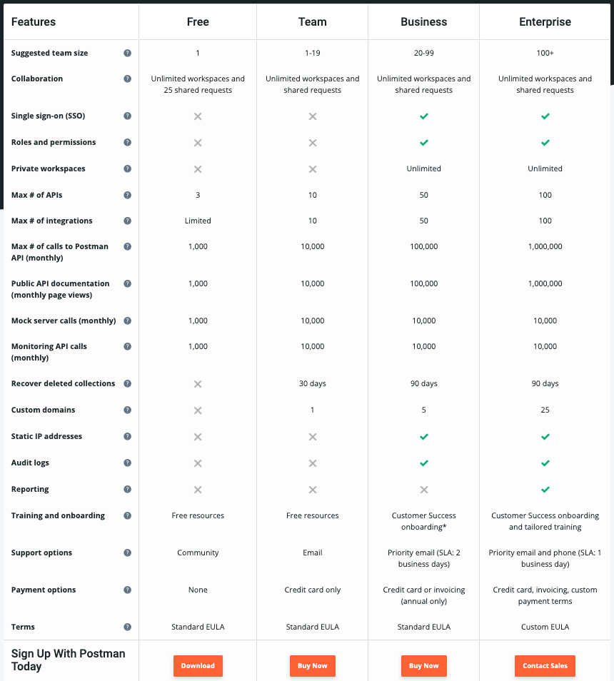
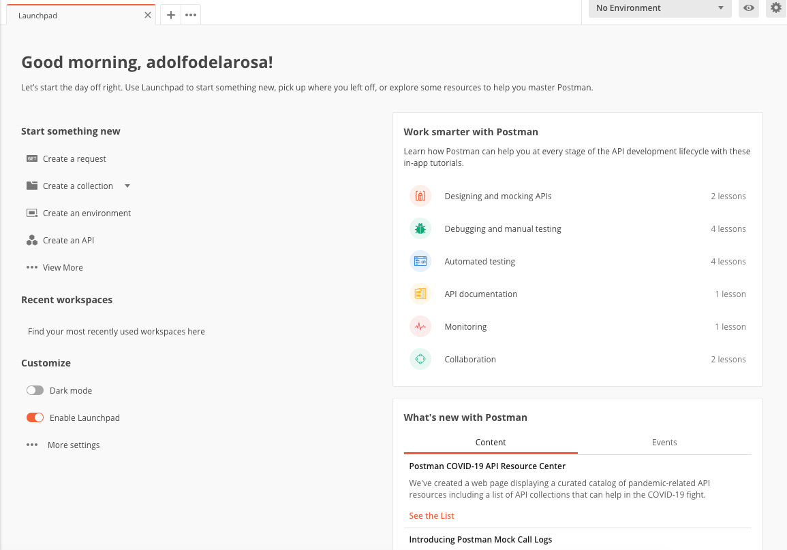
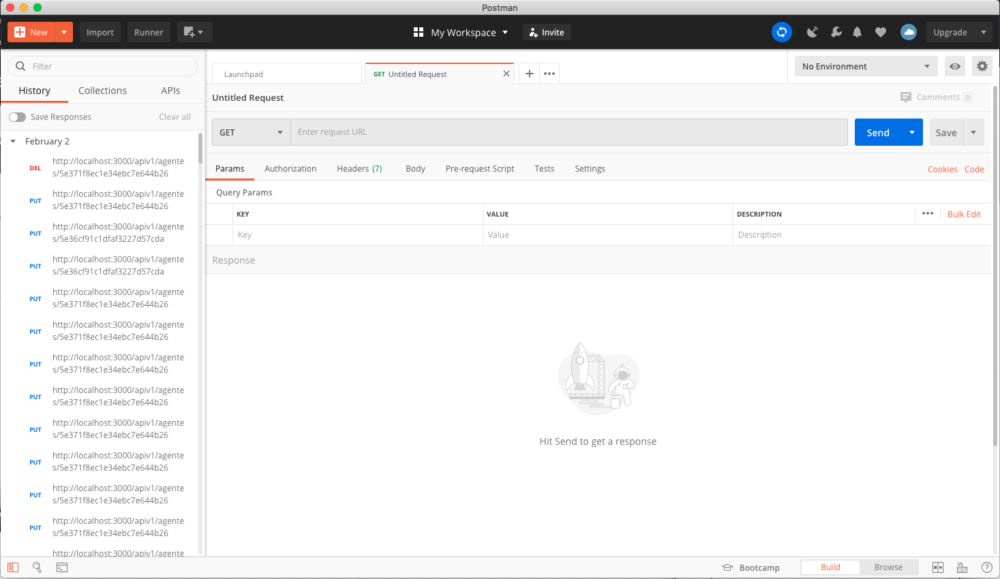
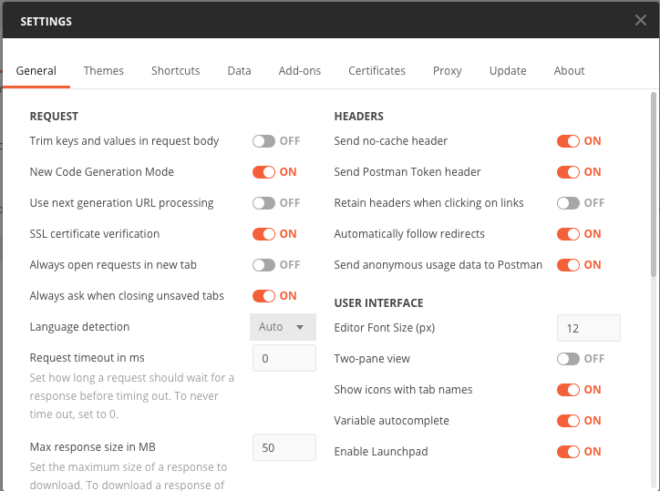
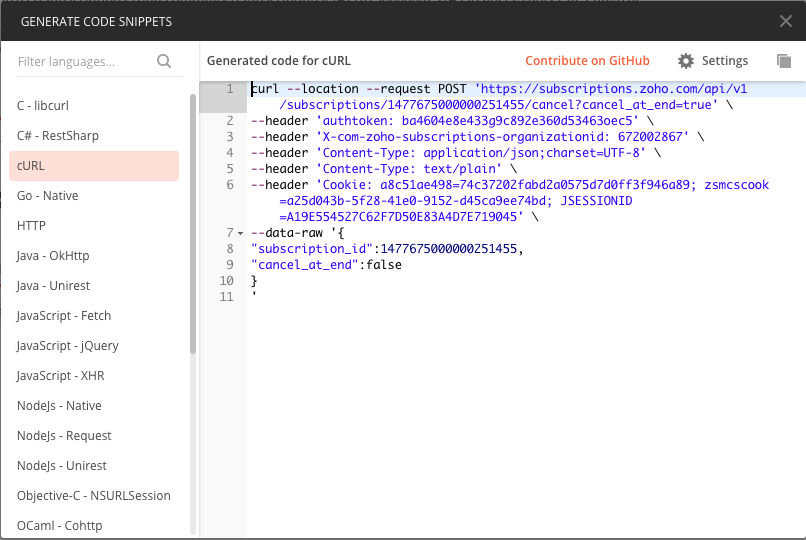
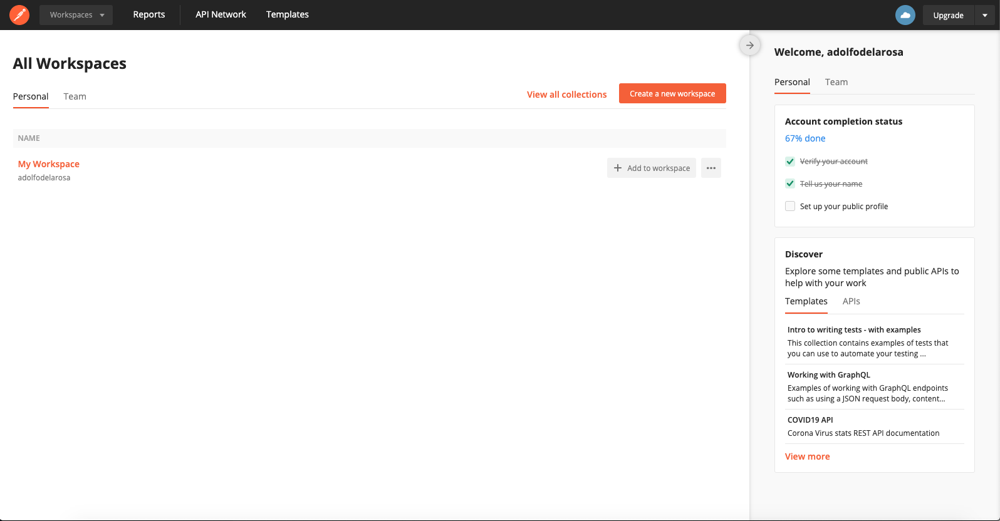
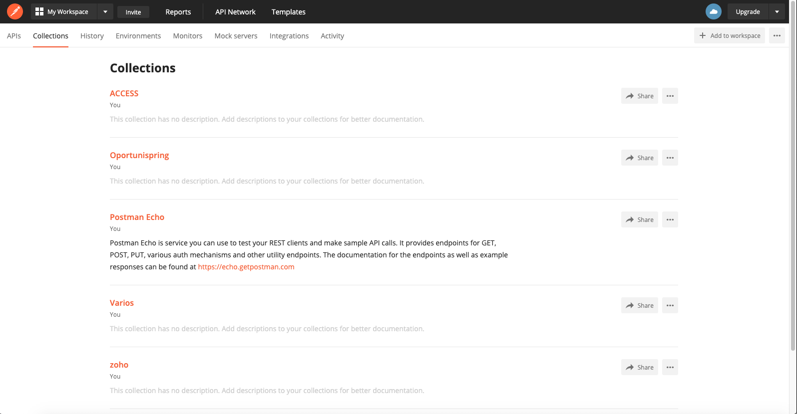

# 4. Introducción a Postman 27m

* ¿Qué es Postman? 3:07 
* Instalación y configuración de Postman 16:19 
* Dashboard de Postman 2:22 
* Otras alternativas para testing de APIs REST 5:37 
* Contenido adicional 2

## ¿Qué es Postman? 3:07 

[¿Qué es Postman?](pdfs/Qué_es_Postman.pdf)

https://www.postman.com/

[Instalación y primeros usos de Postman](https://openwebinars.net/blog/instalacion-y-primeros-usos-de-postman/)

Postman de una manera muy resumida se puede decir que es una **herramienta para probar APIs**, para lo cual ofrece diversias funcionalidades:

* Interactuar con un servicio REST.
* Generar y automatizar pruebas.
* Generar scrips para acceder a las diferentes peticiones.
* Mockear servicios.
* Documentar.
* Monitorizar periodicamente.
* Publicar las documentaciones.
* Uso de plantillas.

Una herramienta para mejorar el desarrollo de la API.

Existen diferentes opciones de planes. 

## Instalación y configuración de Postman 16:19 

Para descargar la aplicación vamos a:

https://www.postman.com/downloads/

Una vez instalada la aplicación Postman pide que nos autentiquemos, esto sirve para que funciones de colobarión entre otras nos puedadn identificar. Podemos entrar sin autenticacion pero perdemos ciertas funcionalidades.

Una vez que carga postman se nos presenta la ventana de Bienvenida:

Si se nos llega a perder podemos hacer que apareza con `rm ~/Library/Application\ Support/Postman/window`.

Esta página de Launch nos proporciona atajos para acceder rapidamente a las diferentes funcionalidades de Postman. Podremos crear:

* Crear un **request**
* Crear una **colección**
* Crear un **environmente**
* Crear **documentación**
* Crear un **mock server**
* Crear un **monitor**
* Podemos personalizar el estilo de Postman con `Dark mode`
* Muestra tutoriales para cada etapa del ciclo de vida de desarrollo de API.
* Y articulos de lo mas novedoso del Postman y el mundo como el Covit-19(APIs para consular la epidemia)
* Explore algunas **templates**(plantillas) y API públicas que pueden resultarle útiles

Postman tiene dos tipos de productos:

* La aplicación Postman
* Red de APIs, algo sobresaliente con respecto a otros competidores como Insomnia, soapUI, Paw o Swagger. Incluyen muchos proyectos de colecciones realizadas por gente experta para descargarse localmente gratuitamente. Podemos acceder a APIs profesionales como Paypal u otras, donde ya esta todo desarrollado simplemente para usarse.

[Ventajas de Postman sobre otros entornos similares](https://openwebinars.net/blog/ventajas-postman-sobre-otros-entornos-similares/).

### Ventana Postman

La ventana de Postman se divide basicamiente en tres partes:

* Barra de tareas.
* Barra lateral para Historial y Colecciones.
* Parte donde se realizan las peticiones.
* Barra inferior.

#### Barra de tareas.

* **Botón New**:

   * Crear un **request**
   * Crear una **colección**
   * Crear un **environmente**
   * Crear **documentación**
   * Crear un **mock server**
   * Crear un **monitor**
   
* **Import**: Importar elementos ya existentes.
   
* **Runner**: Herramienta para ejecutar una colección completa.

* Abrir nuevas pestañas

* **Workspace**: Seleccionar en que espacio de trabajo queremos trabajar, pueden ser Personales o de Equipo.

* **Botón Sync**: Botón para sincronizar Postman, para cuando trabajamos en un espacio de trabajo y necesitamos los ultimos cambios.

* **Proxies**

* **Cookies**

* **Documentación**: https://learning.postman.com/docs/postman/launching-postman/introduction/

* **Notificaciones**

* **Enlace a nuestra cuenta**

* Resumen del uso de nuestra cuenta.

* **Settings**

   Las Settings nos permiten configurar varios opciones para trabajar con nuestros Request.

   
   
   Otras cosas que podemos configurar son:
   
   * Temas
   * Atajos de teclado
   * Exportar datos
   * Certificados
   * Proxys
   * Actualizaciones automaticas

#### Barra lateral para Historial y Colecciones.

Podemos ver todo el historial de los request que hemos realizado organizados por fechas. También podemos construir nuestras colecciones.

#### Parte donde se realizan las peticiones.

* Podemos seleccionar los diferentes Métodos GET, POST, etc.
* Podemos ingresar la URL 
* Podemos definir los diferentes parámetros de la Request `Params`, `Authorization`, `Headers` y `Body` 
* Podemos definir Scripts antes de la ejecución `Pre-request Script` o despues de envíar la petición `Tests`
* Podemos definir Settings:
   * Automatically follow redirects
   * Follow original HTTP Method
   * Follow Authorization header
   * Remove referer header on redirect
   * Encode URL automatically
* Manejo de Cookies
* **Code** Una de las opciones más interesantes.

   En base a una Request que tengamos si pinchamos en Code automaticamente nos genera el código HTTP para ejecutarlo en otro tipo de plataformas, pero ademas de un HTTP me lo puede generar para un comando cURL, o código JS, Java, C, etc. Es una herramienta muy potente para compartir Request con gente que no utilice Postman.

   

* Podemos comentar las peticiones
* Podemos generar ejemplos

La vista de las Peticiones tiene dos partes por un lado donde se hace toda la petición. lo que hemos explicado y la Respuesta  la cual contiene:

* Body
* Cookies
* Headers
* Test Result
* Código devuelto
* Tiempo
* Tamaño
* Salvar respuesta como ejemplo o como archivo
* Vistas 
   * Pretty
   * Raw
   * Preview
   * Visualize
* JSON
* Wrap Line

#### Barra Inferior

* Ocultar barra lateral
* Buscar textos
* Abrir la consola: Nos permite depurar las peticiones que hagamos, nos da más información que no vemos en la vista principal.
* Bootcamp
* Vista Build o Browse
* Paneles Horizontales o Verticales
* Atajos de teclado
* Ayudas

## Dashboard de Postman 2:22 

Para entrar al **Dashboard** nos logeamos en la pagina https://www.postman.com/

Es una herramienta para tener información de nuestra cuenta. Podemos ver los diferentes Workspaces Personales o de Equipo que tengamos así como crear nuevos.

Si entro al único Workspace que tengo podemos ver sus diferentes Colecciones, su historial, enviroments, monitores, mocks, Integraciones y toda la Actividad que hemos realizado.

Ademas puedo ver información sobre mi cuenta, que plan tengo contratado etc.

## Otras alternativas para testing de APIs REST 5:37 

[Otras alternativas para testing de APIs REST](pdfs/Otras_alternativas.pdf)

Postman no es la única alternativa para trabajar con APIs REST 

* **Fiddler**

   Esta es una herramienta para analizar el trafico de peticiones HTTP, pero como herramienta de Tests se queda corta. Pero es uno de los mejores para analizar el trafico y usarlo como Proxy. 

* **Charles**

   Muy similar a Fiddler.

* **cURL**

   Herramienta de las más antiguas pero también de las más utilizadas, paquete para Linux con el que podemos enviar peticiones a través de la línea de comandos a las APIs. Esto es lo que hace Newman que es uno de los plugins de Postman. El cURL se puede generar a través de Postman para compartirlo con usuarios de Linux.

* **Navegadores web**

   Podemos ingresar el URL del Enpoint en un navegador y nos servira para probar mi Request, ademas de que se puede usar las herramientas de desarrollador para ver los tipos de respuesta y el envio de parámetros al Endpoint, entre otras cosas.

* **soapUI**

   Herramienta muy antigua pero muy completa pero poco intuitiva. Muy orientada al Testing. Para complementarse necesita integrarse con otros paquetes. Creada por SMARTBEAR que es la mismi compañia que creo [Swagger](https://swagger.io/) para documetación de APIs.

* **Paw (Mac)**

   Versión temprana e inmadura de Postman, no implementa todo lo que hace Postman pero su interfaz es muy intuitiva.

* **Assertible (Web)**

   Aplicación web, que se puede ejecutar desde cualquier sitio, pero no tan completa como Postman.
   
* **Stoplight (Web)**

   Aplicación web, que se puede ejecutar desde cualquier sitio, pero no tan completa como Postman.
   
* **Insomnia**

   Es la alternativa más interesante y la que tiene más futuro, una interfaz muy intuitiva, permite importar/exportar plugings hechos con Node
* ...

## Contenido adicional 2

[¿Qué es Postman?](pdfs/Qué_es_Postman.pdf)

[Otras alternativas para testing de APIs REST](pdfs/Otras_alternativas.pdf)
