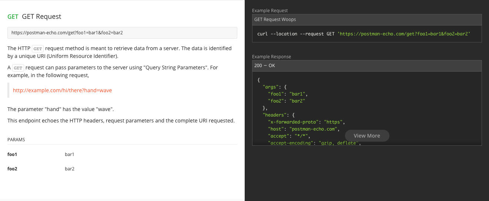
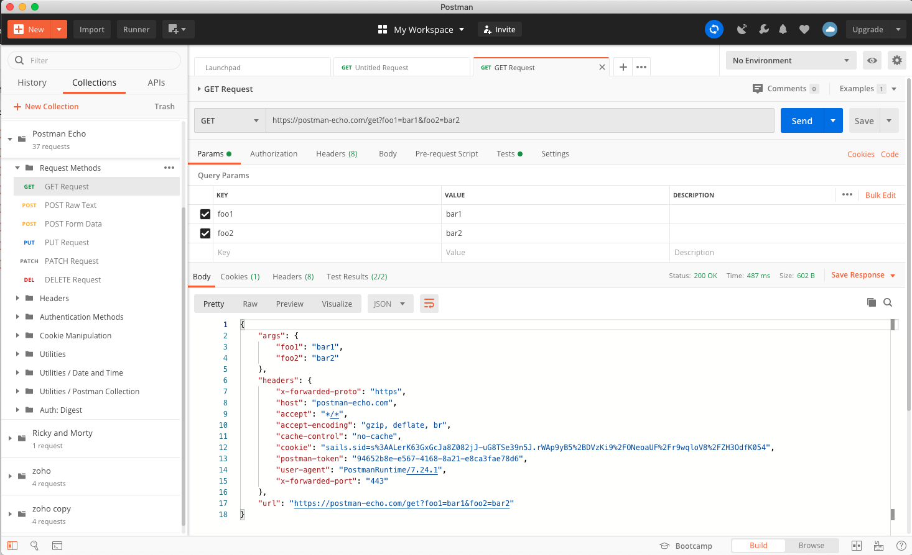
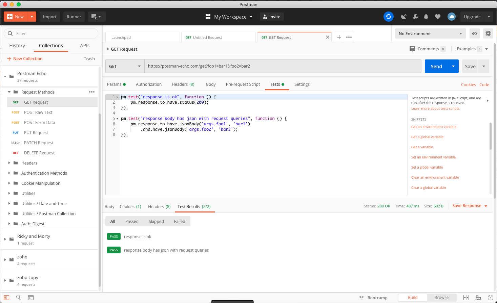
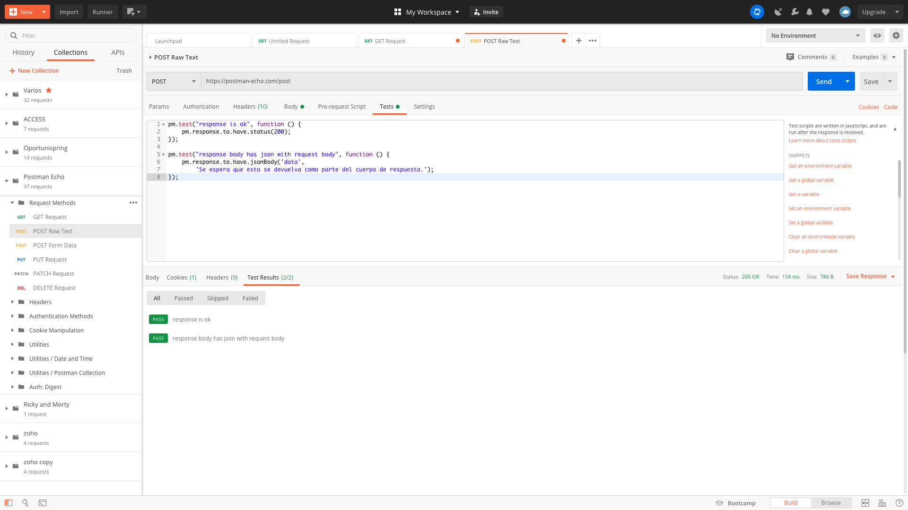

# 5. Colecciones y variables 48m

* Enviando nuestra primera petición con Postman 11:27 
* ¿Qué son las colecciones? 17:42 
* Entornos 19:04 
* Contenido adicional 1

## Enviando nuestra primera petición con Postman 11:27 

[Enviando nuestra primera petición con Postman](pdfs/Enviando_nuestra_primera_petición_con_Postman.pdf)

[Instalación y primeros usos de Postman](https://openwebinars.net/blog/instalacion-y-primeros-usos-de-postman/)

### API REST THE RICK AND MORTY API

Para realizar nuestra primera petición con Postman usaremos el API REST **THE RICK AND MORTY API**.

https://rickandmortyapi.com/


Es una API publica no se necesita autenticación para acceder a ella, podemos ver su documentación.


En este caso vamos a obtener la lista de episodios para lo cual seleccionamos *Episode > Episode schema*.


#### Obtener todos los episodios 

Puede acceder a la lista de los episodios usando el endpoint `/episode`.

https://rickandmortyapi.com/api/episode/


Este es el ejemplo de la salida.

Creamos un nuevo Requests:


Le damos un nombre, descripción y lo podemos guardar en una colección. Posteriormente hay que indicar los datos de la petición:


Indicamos el método que usaremos para hacer el request así como la URL, en este caso:

`GET https://rickandmortyapi.com/api/episode/`

Vemos que también podemos añadir Script que se ejecunten antes de la petición (pre-request Scripts) y después de la petición (Tests) como por ejemplo para poder validar parámetros es decir para hacer pruebas. A pesar de que los Scripts se definen en JavaScript no hace falta un conocimiento extensivo de Java Script para poder crear pruebas ya que se incluyen diversos snippets ya preprogramados listos para usarse. En nuestro caso incluimos el que comprueba que el Código de Estado sea 200.

Si pulsamos en `Code` podemos ver la petición completa que estamos realizando:


Como respuesta obtenemos la lista de los 20 episodios:


```js
{
    "info": {
        "count": 31,
        "pages": 2,
        "next": "https://rickandmortyapi.com/api/episode/?page=2",
        "prev": ""
    },
    "results": [
        {
            "id": 1,
            "name": "Pilot",
            "air_date": "December 2, 2013",
            "episode": "S01E01",
            "characters": [
                "https://rickandmortyapi.com/api/character/1",
                "https://rickandmortyapi.com/api/character/2",
                "https://rickandmortyapi.com/api/character/35",
                "https://rickandmortyapi.com/api/character/38",
                "https://rickandmortyapi.com/api/character/62",
                "https://rickandmortyapi.com/api/character/92",
                "https://rickandmortyapi.com/api/character/127",
                "https://rickandmortyapi.com/api/character/144",
                "https://rickandmortyapi.com/api/character/158",
                "https://rickandmortyapi.com/api/character/175",
                "https://rickandmortyapi.com/api/character/179",
                "https://rickandmortyapi.com/api/character/181",
                "https://rickandmortyapi.com/api/character/239",
                "https://rickandmortyapi.com/api/character/249",
                "https://rickandmortyapi.com/api/character/271",
                "https://rickandmortyapi.com/api/character/338",
                "https://rickandmortyapi.com/api/character/394",
                "https://rickandmortyapi.com/api/character/395",
                "https://rickandmortyapi.com/api/character/435"
            ],
            "url": "https://rickandmortyapi.com/api/episode/1",
            "created": "2017-11-10T12:56:33.798Z"
        },
        {
            "id": 2,
            "name": "Lawnmower Dog",
            "air_date": "December 9, 2013",
            "episode": "S01E02",
            "characters": [
                "https://rickandmortyapi.com/api/character/1",
                "https://rickandmortyapi.com/api/character/2",
                "https://rickandmortyapi.com/api/character/38",
                "https://rickandmortyapi.com/api/character/46",
                "https://rickandmortyapi.com/api/character/63",
                "https://rickandmortyapi.com/api/character/80",
                "https://rickandmortyapi.com/api/character/175",
                "https://rickandmortyapi.com/api/character/221",
                "https://rickandmortyapi.com/api/character/239",
                "https://rickandmortyapi.com/api/character/246",
                "https://rickandmortyapi.com/api/character/304",
                "https://rickandmortyapi.com/api/character/305",
                "https://rickandmortyapi.com/api/character/306",
                "https://rickandmortyapi.com/api/character/329",
                "https://rickandmortyapi.com/api/character/338",
                "https://rickandmortyapi.com/api/character/396",
                "https://rickandmortyapi.com/api/character/397",
                "https://rickandmortyapi.com/api/character/398",
                "https://rickandmortyapi.com/api/character/405"
            ],
            "url": "https://rickandmortyapi.com/api/episode/2",
            "created": "2017-11-10T12:56:33.916Z"
        },
        
        . . . 
    ]
}
```

Adicionalmente me regresa:

* Status 200 OK
* Time 640 ms
* Size 2.64 KB
* Headers
 
   
   
* Lista de los Tests que definimos y su resultado.   

   


### API REST Postman Echo

Para realizar nuestra segunda petición con Postman usaremos el API REST **Postman Echo**.

https://docs.postman-echo.com/?version=latest


**Postman Echo** es un servicio que puede usar para probar sus clientes REST y hacer llamadas API de muestra. Proporciona endpoints para `GET`, `POST`, `PUT`, varios mecanismos de autenticación y otros endpoints de utilidad.

La documentación para los endpoints y los ejemplos de responses se pueden encontrar en https://postman-echo.com

Observe el botón `Run in Postman` si lo presionamos me incluira en el Postman local una colección llamada `Postman Echo` con 37 Request, es decir todos los ejemplos del API.


### Request Methods

HTTP tiene múltiples request "verbs", como `GET`, `PUT`, `POST`, `DELETE`, `PATCH`, `HEAD`, etc.

Un método HTTP (verbo) define cómo un servidor debe interpretar una solicitud. Los endpoints en esta sección muestran varios verbos HTTP. Postman admite todos los verbos HTTP, incluidos algunos de uso poco frecuente, como `PROPFIND`, `UNLINK`, etc.

Para obtener detalles sobre los verbos HTTP, consulte [RFC 2616](https://www.w3.org/Protocols/rfc2616/rfc2616-sec9.html#sec9)

#### GET Request

El HTTP GET request method está destinado a recuperar datos de un servidor. Los datos se identifican mediante un URI (identificador uniforme de recursos) único.

Una solicitud GET puede pasar parámetros al servidor utilizando "Query String Parameters". Por ejemplo, en la siguiente solicitud,

http://example.com/hi/there?hand=wave

El parámetro "hand" tiene el valor "wave".



El URL que usarmos para el método `GET` es:

https://postman-echo.com/get?foo1=bar1&foo2=bar2

Este URL esta formado de:

* Protocolo `https`
* Host `postman-echo.com`
* Path parameters `/get`
* Query params `?foo1=bar1&foo2=bar2` (*Podrimos poner cualquier nombre y valor que queramos.*
   
   PARAMS

   Nombre | Valor
   -------|------
   foo1 | bar1
   foo2 | bar2

Este endpoint "hace eco" de los request parameters(*Query params*), los HTTP headers y el URI requested.



Vemos que dentro de **args** nos regresa los parámetros(*Query params*) que nosotros enviamos, dentro de **headers** nos regreasa los HTTP headers y en **url** regresa el URI requested. 

Este ejemplo también tiene Scripts que se ejecunten y después de la petición (Tests)



Uno es para veridicar que el código de estado retornado sea 200 y el otro para que verifique que lo que responde sea un JSON. Ambos tests los pasa satisfactoriamente.

#### POST Raw Text



El método request HTTP POST está destinado a transferir datos a un servidor (y obtener una respuesta). Los datos que se devuelven dependen de la implementación del servidor.

Una solicitud POST puede pasar parámetros al servidor utilizando "Query String Parameters", así como el Request Body. Por ejemplo, en la siguiente solicitud,

`POST /hi/there?hand=wave`

El parámetro "hand" tiene el valor "wave". El request body puede estar en múltiples formatos. Estos formatos están definidos por el tipo MIME del request. El tipo MIME se puede configurar con el HTTP header `Content-Type`. Los tipos MIME más utilizados son:

* `multipart/form-data`
* `application/x-www-form-urlencoded`
* `aplication/json`

Este endpoint "hace eco" de los HTTP headers, request parameters, el contenido del request body y el URI requested entero.

BODY raw|
--------|
This is expected to be sent back as part of response body.|

## ¿Qué son las colecciones? 17:42 

Puedes consultar la documentación oficial sobre las colecciones de Postman [aquí](https://learning.postman.com/docs/postman/collections/intro-to-collections/).

## Entornos 19:04 

Puedes consultar la documentación oficial sobre los entornos de Postman [aquí](https://learning.postman.com/docs/postman/variables-and-environments/variables/).

## Contenido adicional 1

[Enviando nuestra primera petición con Postman](pdfs/Enviando_nuestra_primera_petición_con_Postman.pdf)
